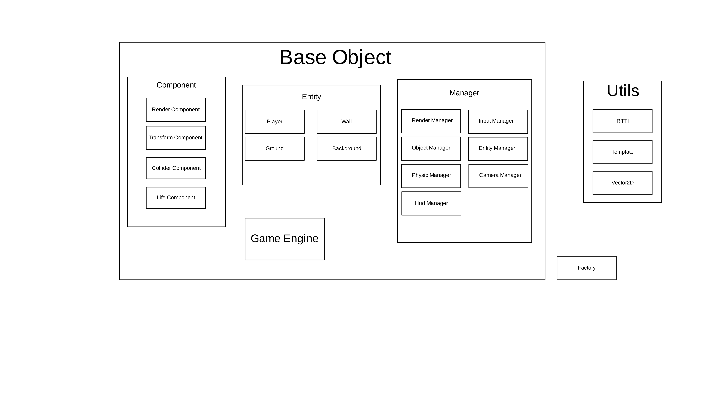

# LuigiUltimateEdition

## Prérequis

Installer VCPKG : ```git clone https://github.com/microsoft/vcpkg``` 
puis dans le dossier vcpkg cloner lancer le fichier : ```.\bootstrap-vcpkg.bat```

ensuite ajouter le dossier vcpkg dans les variables d'environement windows:
  - Dans modifier les variables d'environements sélectioner variables d'environement
  - Puis sélectioner le dossier path (dans système ou user) puis modifier
  - Pour finir cliquer sur nouveau et ajouter le chemin de votre dossier vcpkg
(il est conseiller de redémarer après avoir modifier les variables d'environement)

Installer CMake, il faut au minimum la version 3.25

Installer Visual Studio

## Installation

Cloner le repo ou récupérer le zip et extraire le dossier.

Puis lancé le fichier ```build.bat```

Ensuite lancé le projet via le fichier LUIGIUltimateEdition.sln dans out/binaries avec visual studio.

Une fois dans visual studio, et que le projet est lancer faites un click droit sur le dossier LuigiUltimateEdition puis définiser le en tant que projet de démarrage.

## Architécture du projet


